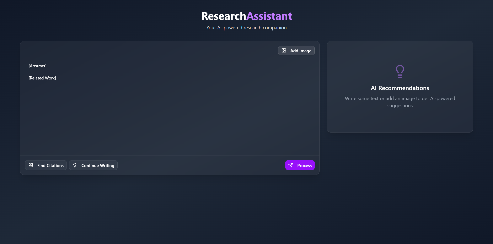

# Research Paper Assistant

Tool that speeds up research paper writing. Made as part of the Data Science Lab course at the MSc Data Science in ETH Zurich. 

## 1. Setup guide

### 1.1 Repository and poetry environment

Clone the repository:

```
git clone https://github.com/LuisCarretero/dsl-research-assistant.git
```

Install the poetry environment

```
poetry install
```

Make sure to activate the poetry environment when running the code

```
poetry env activate
```

### 1.2 Data and backend setup

In the master project directory, create a new `.env` file and fill it with the following information:

```bash
HF_TOKEN = "<HUGGING_FACE_TOKEN>"
DP_SUPERDIR = "<PATH_TO_PROJECT_MASTER_DIR>\data"
```

### 1.3 Instructions to run UI

Make sure docker engine is running in the background (You have docker desktop open).
Open the master directory where where you cloned the repository.
Run the following commands to start the UI docker:

```
cd fontend/research-assistant
docker build -t research-assistant .
docker run -p 3000:3000 research-assistant
```

In your browser go to http://localhost:3000/ .

Next, you need to run the Milvus docker. The instructions are slightly different if you are running on Windows or Linux

**Windows** \
In a new terminal, from the project master directory run:

```
cd backend/milvus-docker
standalone_embed.bat start
```

**Linux** \
In a new terminal, from the project master directory run:

```
cd backend/milvus-docker
bash standalone_embed.sh start
```

Finally, in a new terminal, run (both Windows and Linux):
```
uvicorn src.api.app:app --host 0.0.0.0 --port 8000 --reload
```

## 2. Using the UI

### 2.1 Input format

The input text in the UI must contain the `[Abstract]` and `[Related Work]` title text, for the parser to recognize the two sections:



### 2.2 Finding citations

Provide an abstract or description of the paper you wish to write the Related Work section for under the `[Abstract]` keyword and click on find citations. From the list of citations, select which ones you want to include by clicking `Insert Citation`. To generate writing continuations, click on `Continue Writing` (NOTE: this will only work if a citation was inserted prior to clicking the button). To caption an image, click in `Add Image`. To include the caption, click on `Use This Caption`. Below you will see a brief demo of these options:


